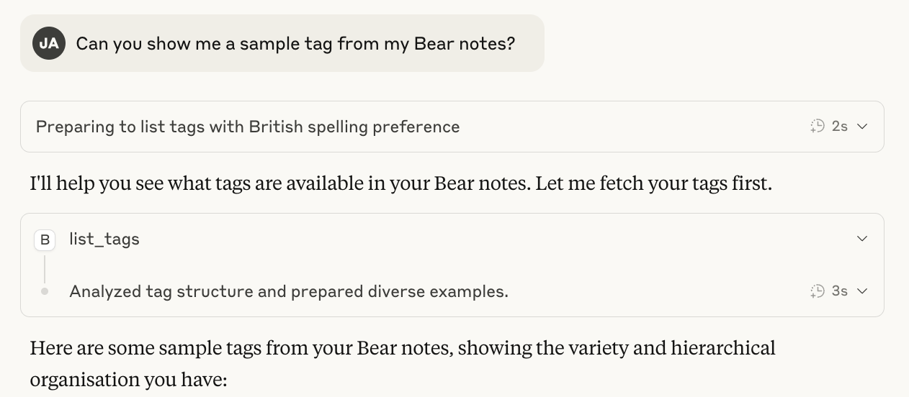

# The Bear MCP Server

## A Most Cordial Compendium of Epistolary Correspondence Regarding the Ingenious Apparatus for the Conveyance of Bear Notes unto Claude

---

### Letter the First

*Being a General Introduction to the Purpose and Character of this Remarkable Invention*

---

The Royal Society of Computational Advancement
Burlington House, Piccadilly
London, 14th December 1887

My Dearest Colleague and Esteemed Fellow of the Academy,

I write to you this evening by the flickering light of my study lamp, my heart brimming with enthusiasm of the most considerable magnitude, for I have at last completed documentation of that most wondrous contraption which has occupied my every waking thought these past several months—the **Bear MCP Server**.

This marvellous apparatus, conceived in the noble language of Rust (Edition 2024, if you can fathom such modernity!), serves a singular and most distinguished purpose: to establish an ethereal bridge betwixt the venerable Claude—that most perspicacious of artificial intellects—and the Bear.app repository of notes, facilitating the harmonious exchange of textual memoranda through the offices of the Model Context Protocol.

The mechanism operates thusly: the Server connects, in a manner most genteel and read-only, to the SQLite database wherein Bear.app maintains its precious collection of notes. Through this connection, it exposes two principal instruments of inquiry—`list_notes` and `list_tags`—permitting Claude to peruse one's personal collection of written thoughts with all the discretion and capability one might expect of a trusted valet.

I remain, as always, your most obedient servant in the pursuit of knowledge,

**Professor Reginald Bartholomew Thatchwick-Pemberton**
*Fellow of the Royal Society, Chair of Computational Epistolary Studies*

---

### Letter the Second

*Concerning the Proper Installation and Configuration of the Apparatus*

---

The Institute of Mechanical Instruction
Cambridge, 16th December 1887

My Dear Professor Thatchwick-Pemberton,

Your recent correspondence has stirred within me a most fervent desire to acquire and implement this Bear MCP Server of which you speak with such animated passion! Pray, illuminate for this humble scholar the precise methodology by which one might install this splendid creation upon one's own computational engine.

Your eternally curious colleague,
**Dr. Cornelius Whitmore Ashby-Fotherington**

---

The Royal Society of Computational Advancement
Burlington House, Piccadilly
London, 18th December 1887

My Most Inquisitive Dr. Ashby-Fotherington,

Your eagerness to partake of this technological marvel brings me considerable satisfaction! Allow me to elucidate the installation procedures with all due propriety and precision.

**Method the First: Installation via the Cargo Registry**

Should you wish to avail yourself of the public registry maintained by the good stewards of crates.io, you need merely summon your terminal apparatus and inscribe the following incantation:

```bash
cargo install bear-mcp-server
```

**Method the Second: Construction from the Repository Proper**

For those of a more adventurous disposition, who prefer to build their machinery from the foundational components, one may proceed thusly:

```bash
git clone https://github.com/jakubadamw/bear-mcp-server
cd bear-mcp-server
cargo install --path .
```

**The Configuration of Claude's Acquaintance with the Server**

Upon successful installation, one must introduce the Server to Claude by inscribing the following particulars within the configuration file situated at `~/Library/Application Support/Claude/claude_desktop_config.json`:

```json
{
    "mcpServers": {
        "bear": {
            "command": "/Users/[YOUR DISTINGUISHED MACOS USERNAME]/.cargo/bin/bear-mcp-server"
        }
    }
}
```

I trust these instructions shall serve you admirably!

Your faithful correspondent,
**Professor R. B. Thatchwick-Pemberton**

---

### Letter the Third

*A Thorough Discourse upon the Architecture and Principal Components*

---

The Bodleian Library, Oxford
22nd December 1887

Esteemed Professor,

Having successfully installed the apparatus per your most excellent instructions, I find myself consumed with scholarly curiosity regarding its internal mechanisms. Might you favour me with a detailed exposition of its architectural composition?

In studious anticipation,
**Dr. C. W. Ashby-Fotherington**

---

The Royal Society of Computational Advancement
Burlington House, Piccadilly
London, 24th December 1887

My Dear Doctor,

Your thirst for knowledge is as laudable as it is insatiable! Let me draw aside the velvet curtain and reveal the inner workings of this magnificent engine.

**The Principal Modules and Their Noble Functions**

The apparatus comprises several distinct chambers of logic, each attending to its appointed duties with exemplary diligence:

| Module | Purpose Most Distinguished |
|--------|---------------------------|
| **main.rs** | The grand entrance hall, wherein the programme receives its first breath of life, configures the logging apparatus, and initiates the MCP service |
| **mcp.rs** | The drawing room of discourse, housing the `BearMcpServer` structure and the handlers for our two esteemed tools |
| **bear.rs** | The library proper, containing the `BearDatabase` abstraction and all matters pertaining to data retrieval |
| **error.rs** | The infirmary, where errors are classified and treated with appropriate remedies |

**The Data Structures of Consequence**

*The BearMcpServer Structure*

This most important personage serves as the master of ceremonies:

```rust
pub struct BearMcpServer {
    bear_database: Arc<Mutex<BearDatabase>>,  // A thread-safe repository
    tool_router: ToolRouter<Self>,             // The routing mechanism
}
```

*The Note Structure*

Each note from Bear.app is represented by this dignified structure:

```rust
pub struct Note {
    creation_date: chrono::DateTime<chrono::Utc>,  // The moment of conception
    subtitle: Option<String>,                       // A brief secondary title
    text: Option<String>,                           // The substance of the note
    title: Option<String>,                          // The primary appellation
    id: String,                                     // A unique identifier
}
```

*The SearchRequest Structure*

When one desires to search, one submits a request of this form:

```rust
pub struct SearchRequest {
    pub query: Option<String>,  // Words to seek within the notes
    pub tag: Option<String>,    // A categorical label for filtration
}
```

**The AppleCoreDateTime: A Curiosity of Chronometry**

Bear.app, in its wisdom, stores temporal information as floating-point numbers representing seconds elapsed since the 1st of January, 2001—a most unconventional choice! The `AppleCoreDateTime` type handles the conversion to more civilised representations.

I trust this explanation illuminates the machinery to your satisfaction!

With collegial warmth,
**Professor Thatchwick-Pemberton**

---

### Letter the Fourth

*On the Instruments of Inquiry: list_notes and list_tags*

---

The Athenaeum Club
Pall Mall, London
27th December 1887

My Dear Professor,

Your exposition of the architecture was most enlightening! I now seek to understand the practical application—specifically, the two tools you mentioned. How do they operate, and what manner of responses might one expect?

Your curious correspondent,
**Dr. Ashby-Fotherington**

---

The Royal Society of Computational Advancement
Burlington House, Piccadilly
London, 29th December 1887

Dearest Doctor,

Ah, you wish to learn of the instruments themselves! Let me describe them with the care and attention they so richly deserve.

**The list_notes Tool**

This most versatile instrument permits Claude to search through your collection of Bear notes with considerable sophistication. One may provide:

- A **query** string, whereupon the apparatus shall search through titles and texts
- A **tag** for categorical filtration (with or without the leading `#` symbol—the apparatus is most accommodating)

The tool employs a scoring mechanism of considerable ingenuity:

| Match Type | Score |
|------------|-------|
| Exact title match | 0.75 |
| Partial title match | 0.50 |
| Text content match | 0.25 |

Results are returned in order of relevance, the most pertinent notes appearing first.

**The Response Limiting Mechanism**

With the wisdom of Solomon, the apparatus recognises that Claude, despite possessing considerable faculties, cannot process responses of unlimited magnitude. Therefore, it implements an adaptive limiting strategy:

1. The apparatus begins with a limit of 65,536 results
2. It serialises the response and examines its size
3. Should the response exceed 9 megabytes, the limit is halved
4. This process repeats until the response is of manageable proportion

**The list_tags Tool**

This simpler instrument merely retrieves all tags present within your Bear database, permitting Claude to understand the categorical organisation of your notes.

**Example Response from list_notes**

When one invokes this tool, one receives a response of this elegant form:

```json
{
  "notes": [
    {
      "creation_date": "2024-12-19T10:30:00Z",
      "title": "Observations on Steam-Powered Computation",
      "subtitle": "A preliminary treatise",
      "text": "The full contents of the note...",
      "id": "UUID-STRING"
    }
  ]
}
```

I trust this clarifies the matter!

Ever your faithful explainer,
**Professor Thatchwick-Pemberton**

---

### Letter the Fifth

*Regarding the Database and Its Schema*

---

The Museum of Natural Philosophy
South Kensington
2nd January 1888

Most Esteemed Professor,

I have become fascinated by the manner in which Bear.app organises its data. Might you enlighten me as to the structure of the SQLite database from which this marvellous Server draws its intelligence?

In scholarly curiosity,
**Dr. Ashby-Fotherington**

---

The Royal Society of Computational Advancement
Burlington House, Piccadilly
London, 4th January 1888

My Dear Colleague,

Ah, you venture into the very foundations upon which this edifice is constructed! Bear.app employs a database schema originating from Apple's Core Data framework. The principal tables of interest are these:

| Table | Purpose |
|-------|---------|
| **ZSFNOTE** | The grand repository of all notes, containing title, subtitle, text, and temporal metadata |
| **ZSFNOTETAG** | The catalogue of categorical labels (tags) |
| **Z_5TAGS** | The intermediary table facilitating the many-to-many relationship between notes and tags |

The query employed by `list_notes` is a work of considerable craftsmanship:

```sql
SELECT creation_date, subtitle, text, title, id
FROM (
    SELECT
        notes.ZCREATIONDATE AS creation_date,
        notes.ZSUBTITLE AS subtitle,
        notes.ZTEXT AS text,
        notes.ZTITLE AS title,
        notes.ZUNIQUEIDENTIFIER AS id,
        CASE
            WHEN ? IS NULL THEN 1.0
            WHEN notes.ZTITLE = ? THEN 0.75
            WHEN notes.ZTITLE LIKE ? THEN 0.5
            WHEN notes.ZTEXT LIKE ? THEN 0.25
            ELSE 0.0
        END AS text_search_score
    FROM ZSFNOTE notes
    LEFT JOIN Z_5TAGS note_tags ON notes.Z_PK = note_tags.Z_5NOTES
    INNER JOIN ZSFNOTETAG tags ON tags.Z_PK = note_tags.Z_13TAGS
    WHERE (? IS NULL OR tags.ZTITLE = ?)
        AND text_search_score > 0
    GROUP BY id
    ORDER BY text_search_score DESC
)
LIMIT ?
```

Observe the elegant CASE expression, which assigns relevance scores according to match quality!

**A Note of Considerable Import Regarding Read-Only Access**

I must emphasise that the apparatus connects to the Bear database in a strictly **read-only** capacity. One's precious notes are never at risk of modification by this Server. It merely observes; it never alters.

The default location of the database, for those operating upon Macintosh systems, is:

```
~/Library/Group Containers/9K33E3U3T4.net.shinyfrog.bear/Application Data/database.sqlite
```

One may, however, specify an alternative path via the `--bear-db-path` argument or the `BEAR_DB_PATH` environment variable.

With scholarly dedication,
**Professor Thatchwick-Pemberton**

---

### Letter the Sixth

*On Matters of Logging and Diagnostics*

---

The Greenwich Observatory
8th January 1888

Professor Thatchwick-Pemberton,

I have encountered occasional difficulties in my employment of the apparatus. Is there a mechanism by which one might observe its inner workings for diagnostic purposes?

Seeking illumination,
**Dr. Ashby-Fotherington**

---

The Royal Society of Computational Advancement
Burlington House, Piccadilly
London, 10th January 1888

My Dear Doctor,

Fear not, for the apparatus is equipped with a most comprehensive logging system! It employs the `tracing` and `tracing-subscriber` crates to maintain daily rolling logs.

**The Location of Logs**

Your diagnostic records shall be found at:

```
~/.local/share/bear-mcp-server/logs/
```

The logs are organised by date, rolling over at the commencement of each new day—a most civilised arrangement!

**The Level of Verbosity**

The apparatus logs at the DEBUG level by default, ensuring that all events of potential significance are recorded for your perusal.

Should you encounter difficulties, I encourage you to examine these logs with the scrutiny of a detective pursuing clues at a crime scene!

Your servant in troubleshooting,
**Professor Thatchwick-Pemberton**

---

### Letter the Seventh

*Concerning the Testing Apparatus and Quality Assurance*

---

The Royal Institution of Great Britain
21 Albemarle Street
15th January 1888

Esteemed Professor,

As a man of science, I am naturally curious about the methods employed to verify the correctness of this apparatus. What testing regimen has been established?

In the spirit of empirical rigour,
**Dr. Ashby-Fotherington**

---

The Royal Society of Computational Advancement
Burlington House, Piccadilly
London, 17th January 1888

My Dear Empiricist,

Your commitment to verification is most commendable! The testing apparatus employs the following instruments:

**The rstest Framework**

Parameterised tests are constructed using the `#[case]` macro, permitting multiple scenarios to be tested with elegant efficiency.

**The insta Crate for Snapshot Testing**

Test results are compared against stored snapshots, ensuring that any unexpected changes in output are immediately detected and brought to the attention of the maintainer.

**Test Cases of Note**

The test suite examines:
- Filtration by tag
- Free-text search operations
- Queries combining multiple criteria

**The build.rs Script**

During the construction of the apparatus, a special script reads a SQL dump from `test_data/database.sql` and initialises a temporary database for testing purposes. This ensures that tests may be executed without requiring access to an actual Bear installation.

**Continuous Integration via GitHub Actions**

The repository employs a sophisticated pipeline that performs:
- `cargo check` — Verifying compilation
- `cargo clippy` — Enforcing stylistic standards (with warnings treated as failures!)
- `cargo build` — Constructing the artefact
- `mcptools` integration testing — Verifying MCP protocol compliance

With rigorous verification,
**Professor Thatchwick-Pemberton**

---

### Letter the Eighth

*A Visual Demonstration of the Apparatus in Operation*

---

The Crystal Palace
Sydenham Hill
22nd January 1888

My Dear Professor,

I find that I learn best through observation. Might you provide a visual demonstration of this apparatus in its natural employment?

With anticipatory delight,
**Dr. Ashby-Fotherington**

---

The Royal Society of Computational Advancement
Burlington House, Piccadilly
London, 24th January 1888

Dearest Doctor,

Enclosed herewith, please find a photographic reproduction of the apparatus in operation, as observed within the Claude interface:



Is it not a thing of beauty?

With visual evidence,
**Professor Thatchwick-Pemberton**

---

### Letter the Ninth

*A Summary and Closing Remarks*

---

The Reform Club
Pall Mall, London
1st February 1888

My Dearest Professor Thatchwick-Pemberton,

Through our extended correspondence, I have come to appreciate the full magnificence of this Bear MCP Server. Allow me to summarise the key attributes of this remarkable creation:

**Principal Characteristics:**

1. **Two Instruments of Inquiry** — `list_notes` for searching with intelligent ranking, and `list_tags` for retrieving categorical labels
2. **Adaptive Response Limitation** — Ensuring Claude never receives data exceeding its capacity to process
3. **Read-Only Database Access** — Preserving the sanctity of one's notes
4. **Asynchronous Architecture** — Employing tokio for efficient input/output operations
5. **Comprehensive Testing** — Including snapshot testing and MCP protocol verification
6. **Automated Publishing** — Via GitHub Actions to crates.io upon version tagging

I am profoundly grateful for your patient instruction in these matters!

Your eternal friend and colleague,
**Dr. Cornelius Whitmore Ashby-Fotherington**

---

The Royal Society of Computational Advancement
Burlington House, Piccadilly
London, 3rd February 1888

My Dear Friend,

Your summary is exemplary, and your gratitude most warmly received. It has been my distinct pleasure to illuminate the workings of this apparatus for so attentive a student.

May your notes ever be accessible, your queries ever fruitful, and your Claude ever informed!

I remain, now and always, your most devoted servant in the advancement of computational knowledge,

**Professor Reginald Bartholomew Thatchwick-Pemberton, F.R.S.**
*Fellow of the Royal Society*
*Chair of Computational Epistolary Studies*
*Patron of the Society for the Preservation of Well-Documented Code*

---

## Appendix: A Quick Reference for the Impatient Reader

*For those modern individuals who find Victorian correspondence excessively lengthy*

```bash
# Installation
cargo install bear-mcp-server

# Configuration (add to Claude config)
{
    "mcpServers": {
        "bear": {
            "command": "/path/to/.cargo/bin/bear-mcp-server"
        }
    }
}

# Custom database path
bear-mcp-server --bear-db-path=/path/to/database.sqlite
# or
BEAR_DB_PATH=/path/to/database.sqlite bear-mcp-server
```

---

*This documentation was composed with the utmost care and affection for both the Victorian epistolary tradition and the Rust programming language. Any resemblance to actual Victorian scholars, living or deceased, is entirely coincidental and should be attributed to the whimsical nature of artificial intelligence.*

---

**Finis**
